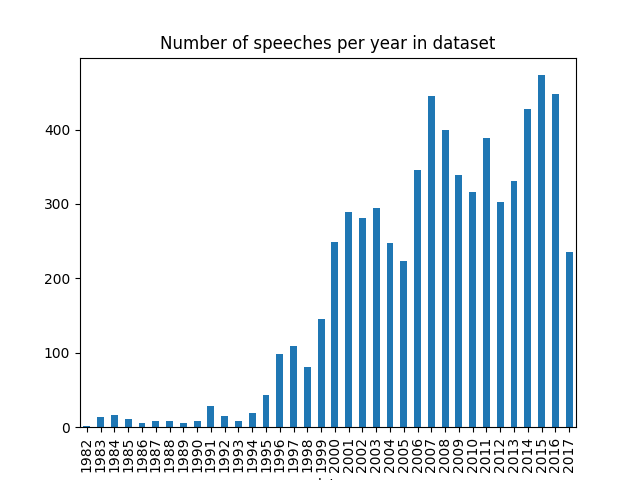
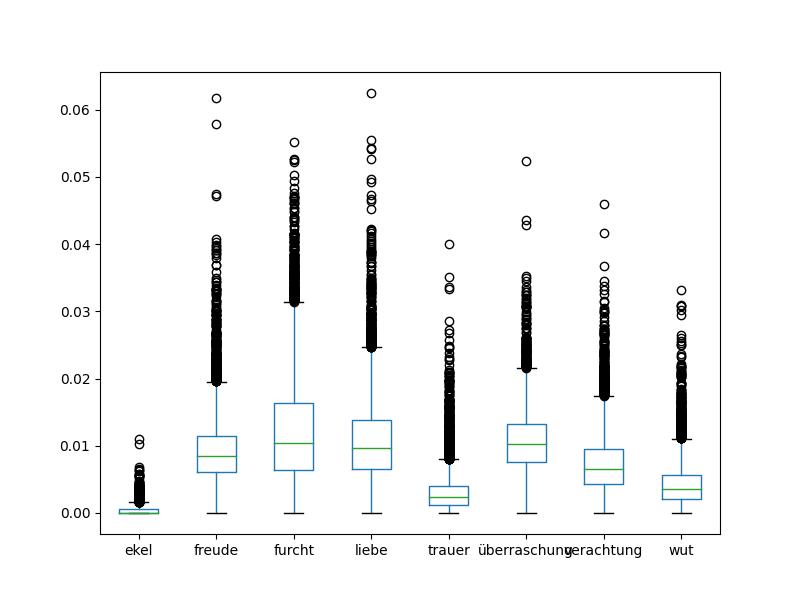
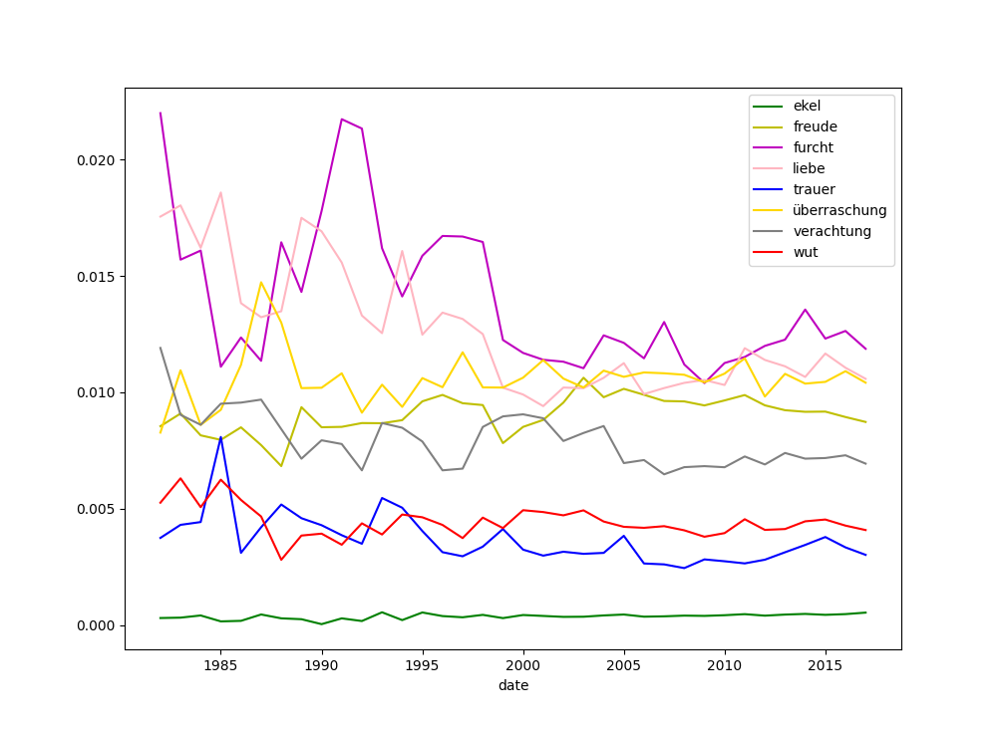
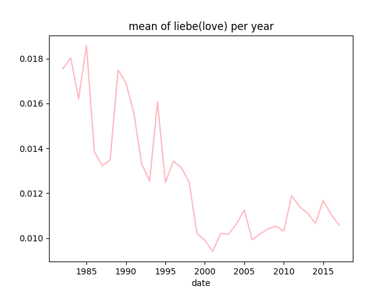
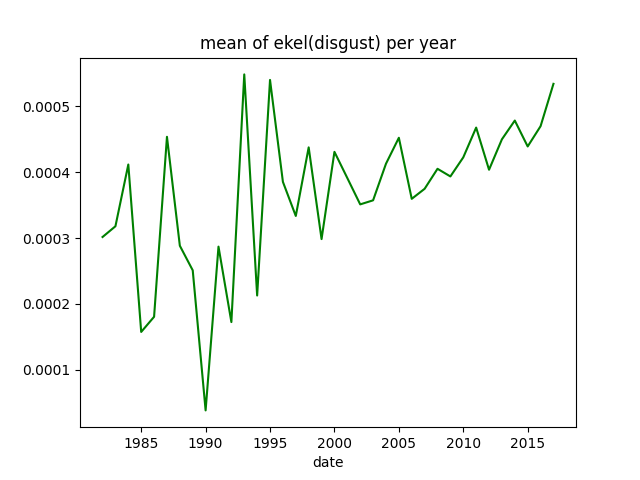
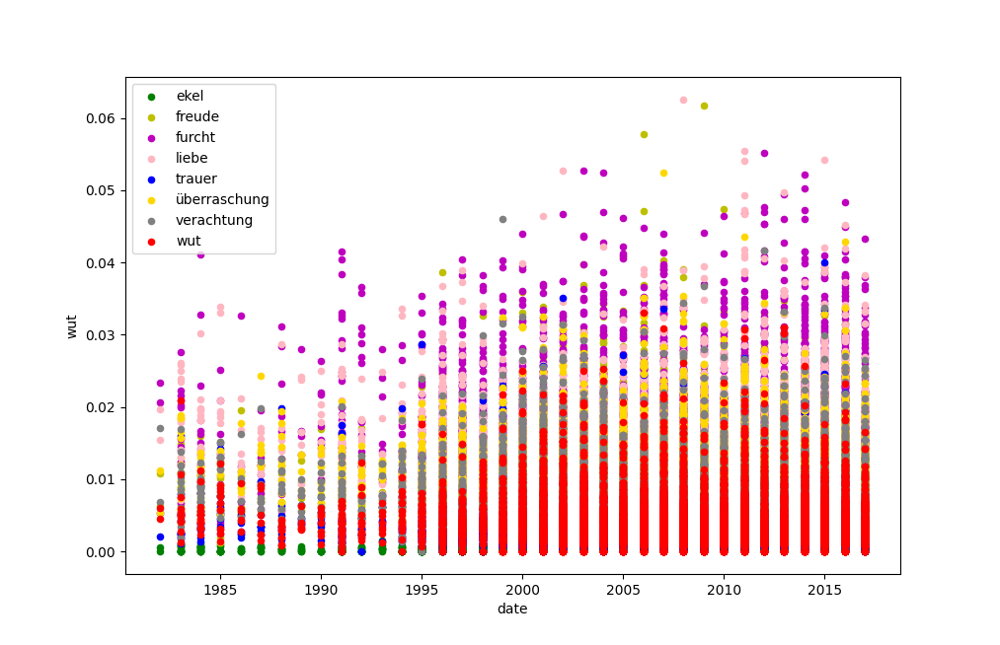
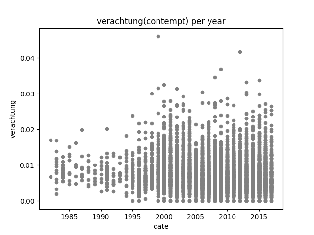
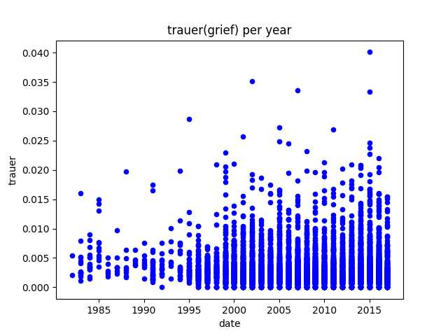
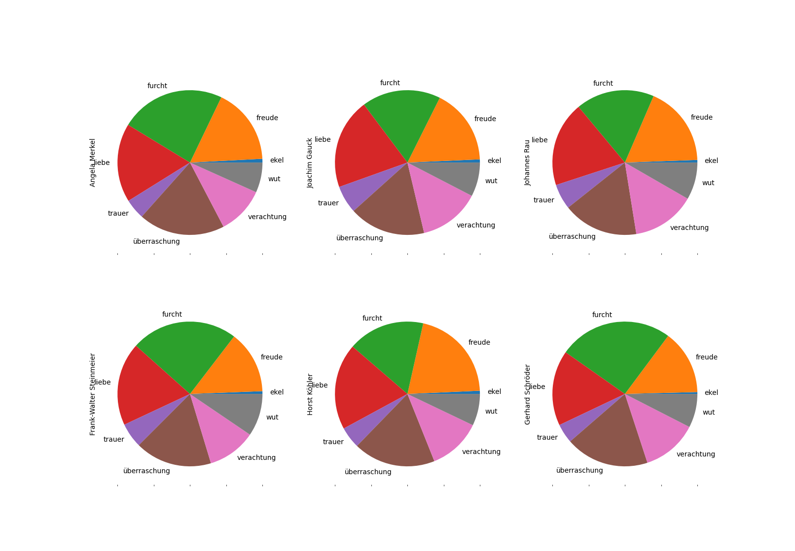

# Sentiments in German political speeches
A sentiment analysis using a lexicon approach on speeches from German politicians  
**Disclaimer**: A pure lexicon approach was used. No deeper meaning should be interpreted into this data,
since a lot of emotional nuances, like irony or negation are lost.

## Table of Content
- [General info](#general-information)
- [Ressources](#ressources)
- [Technologies](#technologies)
- [Setup](#setup)
- [Sample Plots / Documentation](#sample-plots-/-documentation)
- [Conclusion](#conclusion)

## General information
This projects explores speeches from German politicians and their choice of words.  
So for example, whether this politician used more joyful or disgusting words.  
The emotions that were looked at are:  
- love / liebe
- disgust / ekel
- joy / freude
- fright / angst
- anger / wut
- contempt / verachtung
- grief / trauer
- surprise / überraschung
These emotions are roughly based on [Paul Ekman's theory of emotions](https://en.wikipedia.org/wiki/Paul_Ekman#Emotions_as_universal_categories).

## Setup
Clone this repo and run `$ pip install -r requirements.txt`.
Download the speeches from [Adrien Barbaresi](https://adrien.barbaresi.eu/corpora/speeches/) and store them in `sentiments_in_political_speeches/speeches/data`.
Get the emotion dictionary from [here](https://github.com/Jana-Z/german-sentiment-lexicon). Put the emotions into `sentiments_in_political_speeches/emotions/data/emotionsstemmed`.
Run  
```python
def get_emotions_and_store()
```
in `main.py` to load the speeches and check once for sentiments.
The result `speeches.csv` will be stored in `sentiments_in_political_speeches/`.

## Technologies
This project was build using:
- [numpy 1.18](https://www.numpy.org)
- [pandas 1.0](https://pandas.pydata.org)
- [Python 3.7](https://www.python.org/)

## Ressources
The dataset is from [Adrien Barbaresi](https://adrien.barbaresi.eu/corpora/speeches/) and consists of 6665 speeches from 246 speakers.
Plot of number of speeches per year:


## Sample plots / Documentation
All plots were made using the functions in `sentiments_in_political_speeches/plotting/emotions_plotter.py`.

### `plot_average_score()`
plots a box plot using all data and thus gives a overview over the average usage of each emotion in the overall dataset:



### `plot_mean_per_year_all_emotions()`
plots a line plot for all emotions in the dataset and puts all emotions onto one graph. The data before 2000 varys a lot, which could be due to the smaller datasize.



### `plot_mean_per_year()`
plots a line plot for one emotion in the dataset. The data before 2000 varys a lot, which could be due to the smaller datasize.

Example 1: Liebe / Love:


Example 2: Ekel / Disgust:


Plots for all emotions can be found [here](https://github.com/Jana-Z/sentiments_in_german_political_speeches/tree/master/sentiments_in_political_speeches/plotting/plots_big/emotions/means)

### `plot_per_year_all_emotions()`
plots a scatter plot for all emotions in the dataset and puts all emotions onto one graph. The data before 2000 varys a lot, which could be due to the smaller datasize.



### `plot_per_year()`
plots a scatter plot for one emotion in the dataset.

Example 1: Verachtung / Contempt


Example 2: Trauer / Grief


Plots for all emotions can be found [here](https://github.com/Jana-Z/sentiments_in_german_political_speeches/tree/master/sentiments_in_political_speeches/plotting/plots_big/emotions/total)

### `plot_pie_per_politicians()`
plots a pie plot for the n most appearing politicians in the dataset. Each pie shows how much the politician used the corresponding words



## Conclusion
All politician use more or less the same emotions. Only slight changes are distinguishable.
